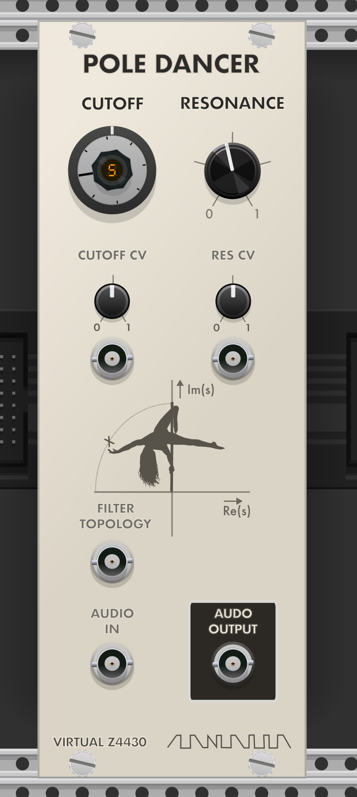
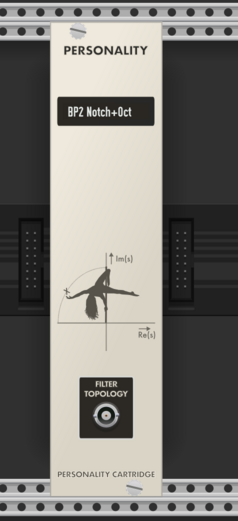
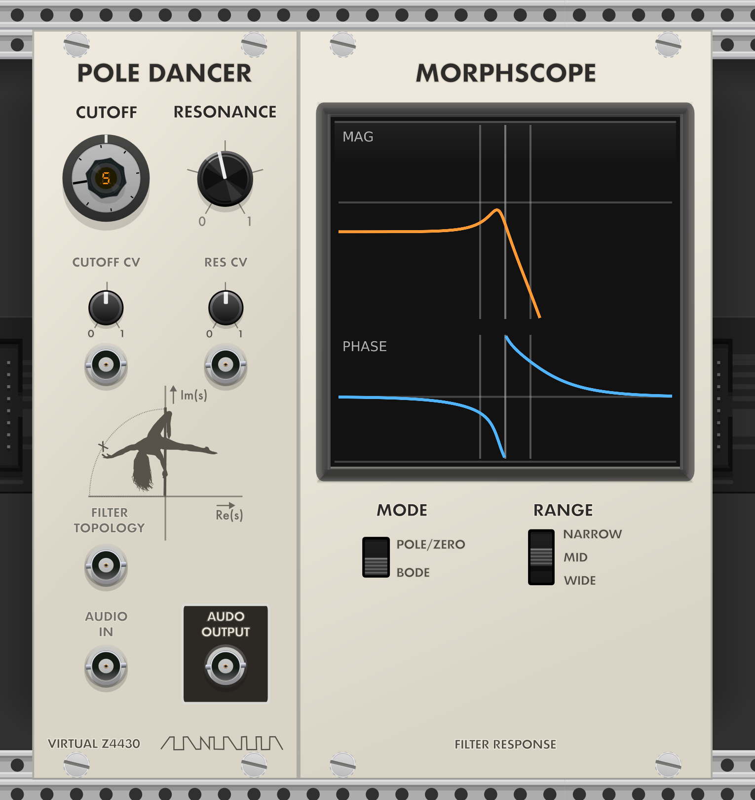
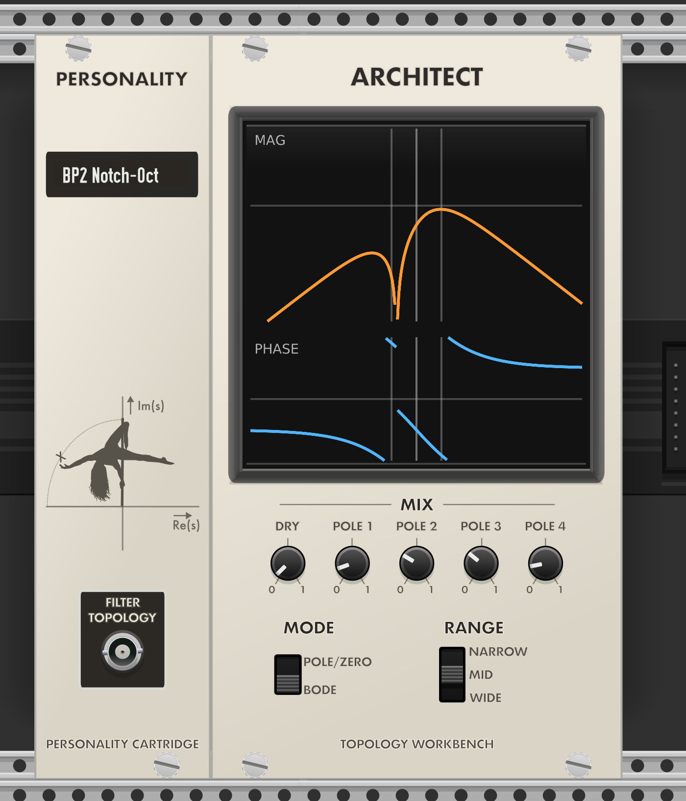
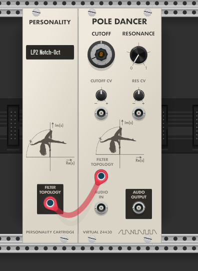
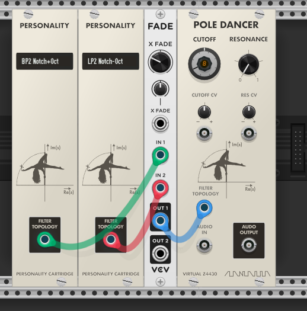
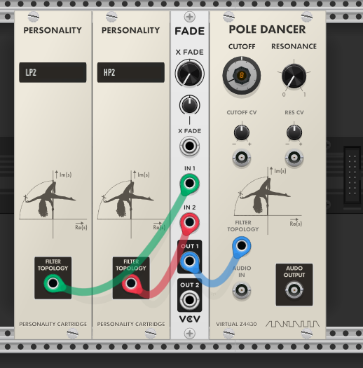
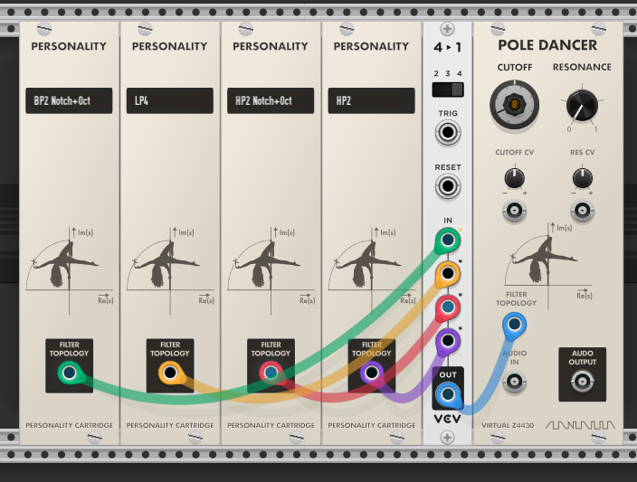
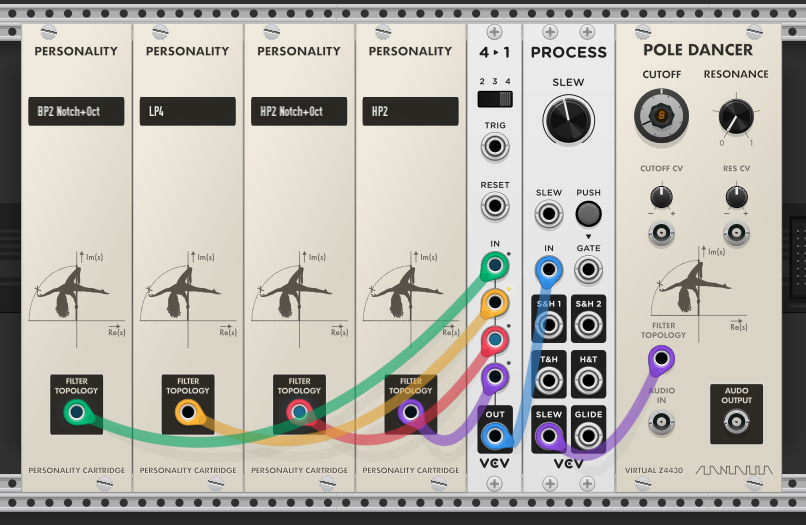
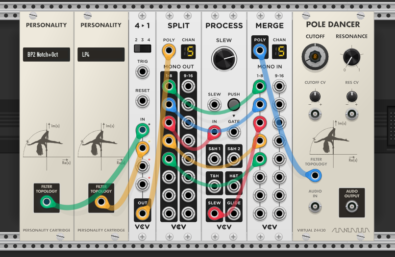

# Zoxnoxious VCV Rack Virtual Modules

The Zoxnoxious "Beyond Obnoxious" VCV Rack-virtual modules live here.  These provide alternatives to the hardware versions in the [Zoxnoxious](https://github.com/brer-rabbit/zoxnoxious) github repo.

## Modules

The TL;DR description of the modules:

* Pole Dancer: a multimode/morphing 4-pole filter

* Personality: defines how the filter behaves

* Architect: Expander for Personality to define/explore new filters

* Morphscope: Expander for Pole Dancer to show filter response

## Quick Start

* Add Pole Dancer
* Add Personality
* Load a preset on Personality
* Patch Personality's Filter Topology output to Pole Dancer
* Send audio into Pole Dancer
* Add additional Personality modules, and processing, for morphing responses

## Detailed Descriptions

Style note: the module interfaces are visually inspired by Nuclear Instrumentation Modules (NIM) hardware.  Frequency cutoff uses a turns-counting dial where one full rotation corresponds to one octave, with the counter displaying the octave.  BNC-style connectors and slotted knurled screws complete the laboratory-instrument aesthetic.

### Pole Dancer

More than just a 4-pole filter.  More than a multimode filter.  The Pole Dancer is able to continuously morph filter responses: imagine going from a notched highpass to the growl of a 4-pole lowpass and ending with a phaser-like effect of an allpass filter.  All sequenced in VCV Rack.

The Pole Dancer by itself is a 4-pole lowpass filter.  Controls are very similar to any other filter.  The notable difference with the filter is the "Filter Topology" input.  This is intended to be patched from a Personality module: either directly or indirectly via other VCV Rack modules.

### Personality

The Personality module defines the filter type for the Pole Dancer.  Many filter types are available as presets: right-click the module to access presets.  Once loaded the filter name is displayed on the module (this is an editable field).  The output can be patched straight to the Pole Dancer or through other modules to affect crossfade, switching, or otherwise morphing filter mode.

The number of presets is huge.  Why so many filters?  Many filters sound similar in isolation, however the way they morph to other filters can be wildly different.

### Morphscope

The Morphscope is available via right-click menu on the Pole Dancer.  This module provides visual feedback on the filter state.  Frequency and phase response are available via the "Bode" setting on the analyzer.  A pole/zero s-plane plot is available as well.

### Architect

The Architect is available via right-click menu on the Personality.  Architect provides a visual feedback of filter response.  Usage is different from the Morphscope: Architect provides five trim pots to control filter pole mix levels.  The levels are sent back to Personality where they can drive a Pole Dancer filter.  The intended *filter design* workflow is to set controls in Architect, name the field in Personality, and save the result as a preset.  For typical use the Architect's controls may be left as-is.  Do note each channel has a massive 32X gain: don't blow your speakers out!  A little does a lot.

## Usage

The Pole Dancer and the Personality introduce a new patch point via a 5-channel polycable.  This patch point is intended to be manipulated by other VCV Rack modules: because the signal is polyphonic CV, standard Rack utility modules can transform filter responses in ways impossible with traditional filters.  Crossfaders, switches, lag processors, etc are all tools you use to manipulate and morph the filter.

The intended signal flow is "filter topology" originates in one or more Personality modules, may cross through processing, and terminates at the Pole Dancer module, morphing and shaping the filter behavior.

Details on the 5-channel patch cord: each channel provides the level for a specific aspect of filter response.

* Dry signal level
* Filter Pole 1 level
* Filter Pole 2 level
* Filter Pole 3 level
* Filter Pole 4 level

Here are a couple ways one can use the signal with Rack modules.  I'll focus on using Fundamental module for processing since those are standard in VCV Rack.

### Single Filter Mode

Instantiate both a Pole Dancer and a Personality module from the module browser.  Right-click on Personality to find a preset.  Patch the Personality's Filter Topology straight to the Pole Dancer's Personality.

### Crossfade Filters

A crossfade is very easy to setup.  Patch two Personality modules to a crossfade, and the output to the Pole Dancer.  Tech suggestion: linear crossfade (-6dB) is likely preferred over constant power crossfade.

One feature of the Oberheim SEM was crossfading between 2-pole highpass to 2-pole lowpass.  That's very easy to emulate with the Pole Dancer.  Just choose the appropriate Personality presets and wire up a crossfade.

### Switches

Switching can be used to jump between filter modes.  The Fundamental switch supports 4 inputs; if four is a limitation many switches in the VCV Rack library support more.

Jumping filter modes might be a bit much.  Including a slew limiter will smooth the transitions between filter modes.

### Advanced Awesomeness

To take things to the extreme, instead of slew limiting the entire filter morph, only slew limit a single filter pole's movement.  Use Split to access the individual channels, slew limit one or more, and merge the result back to the Pole Dancer.  Or, slew limit multiple filter poles at different rates.  The Befaco Slew Limiter is a very good option here as well.

### Audio Rate Modulation

Yes.  The Filter Topology signal can move at audio rate.  The Pole Dancer becomes less a subtractive synth too: sidebands are generated that can range from subtle to aggressive.  One may want to start with simpler waveforms (triangle, sine) for audio rate crossfading.  That said, no requirement there.  At extreme modulation depths Pole Dancer is less like a conventional filter and more like a dynamic spectral processor.

### Envelope-Controlled Filter Morphing

A classic subtractive synthesis technique is sending an envelope to filter cutoff: fast attack, slower decay, moderate resonance.  This creates the familiar effect of a filter quickly opening and then closing.  Try a different approach with Pole Dancer.  Instead of modulating cutoff frequency, use the envelope to control a crossfade between two Personality modules.

Try this:

* Personality A: highpass filter
* Personality B: lowpass filter

Patch an envelope to a crossfade control.  The resulting sound can begin with a sharp burst of high-frequency emphasis before decaying into a lower-frequency resonant body.  Depending on the selected filter responses and modulation depth, the effect may resemble:

* plucked metallic transients
* animated spectral sweeps
* vocal-like movement
* aggressive resonant motion
* evolving phase-like coloration

The important distinction is the envelope is no longer moving only the cutoff frequency.  It is reshaping the filter response itself over time.
